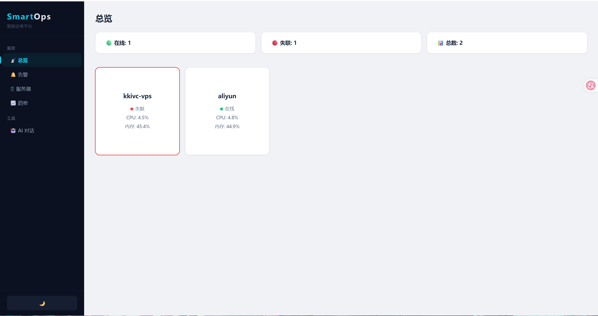
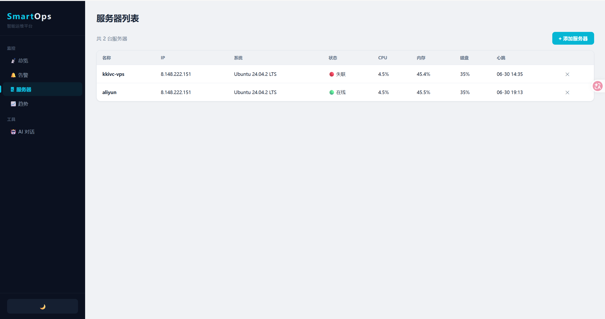
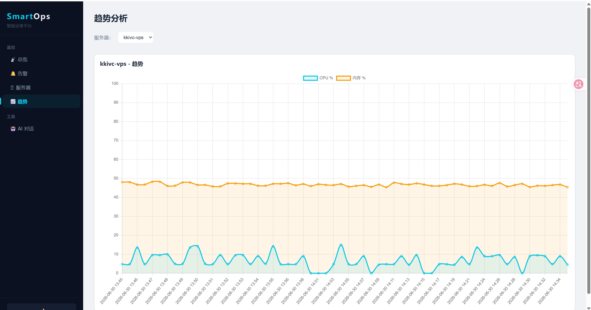
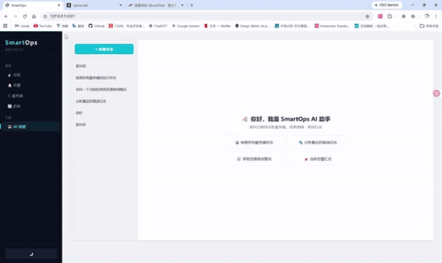
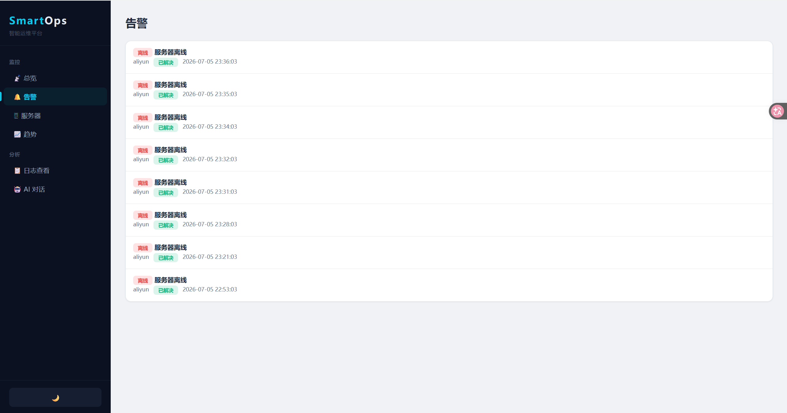

# SmartOps — AI 运维助手

基于 LangChain Agent + RAG 的智能运维平台，支持自然语言查询服务器状态、自动诊断故障、异常告警。

## 项目亮点

**AI Agent 驱动运维**
- LangChain Agent 调用 5 个工具：服务器列表、状态查询、指标趋势、Loki 日志检索、语义知识库
- 自然语言交互：`"分析最近的错误日志"` → Agent 通过 Loki 拉取日志 → 自动诊断 → 返回分析结论
- 自动摘要：第一条消息自动截取为对话标题，历史对话可回溯

**RAG 知识库**
- ChromaDB 向量数据库存储运维文档
- 语义检索辅助故障排查，Agent 自动判断是否需要查询知识库

**自动告警系统**
- 采集器每轮循环检查 CPU/内存/磁盘阈值，超标自动写入告警
- 服务器离线自动标记并生成告警
- 告警状态管理：未处理 → 已确认 → 已解决

**端到端**
- Flask REST API + PostgreSQL
- 前端纯原生 JS SPA（总览/服务器管理/趋势图表/AI 对话/告警页面）
- 采集器多线程调度，SSH 采集实时指标

## 页面预览

| 页面 | 预览 |
|---|---|
| **总览** |  |
| **服务器管理** |  |
| **趋势图表** |  |
| **AI 对话** |  |
| **告警** |  |

## 技术栈

| 层 | 技术 |
|---|---|
| 后端 | Python, Flask, SQLAlchemy, PostgreSQL |
| AI | LangChain Agent, Qwen-Embedding, OpenCode API |
| RAG | ChromaDB, Sentence-Transformers |
| 采集 | Paramiko SSH, Loki 日志推送 |
| 前端 | 原生 JS, Chart.js |

## 快速开始

```bash
# 安装依赖
pip install -r requirements.txt

# 配置环境变量
# 复制 .env.example 到 .env 并填写 DATABASE_URL 和 OPENCODE_API_KEY

# 启动
python api.py
```

访问 http://localhost:5001

## 项目结构

```
service-healthcheck/
├── api.py                  # Flask 主入口，REST API
├── collector/
│   ├── scheduler.py        # 采集调度器（60 秒一轮）
│   └── ssh_client.py       # SSH 客户端封装
├── llm/
│   ├── agent.py            # LangChain Agent 定义
│   ├── tools.py            # Agent 工具函数
│   └── rag.py              # ChromaDB 知识库检索
├── store/
│   ├── db.py               # SQLAlchemy 引擎
│   └── models.py           # 数据模型（Server/Metric/Log/Alert/Conversation/Message）
├── kb/                     # 知识库文档
├── templates/
│   └── dashboard.html      # 前端 SPA 页面
├── data/                   # 向量数据库
├── .env                    # 环境变量
├── README.md
└── requirements.txt
```
