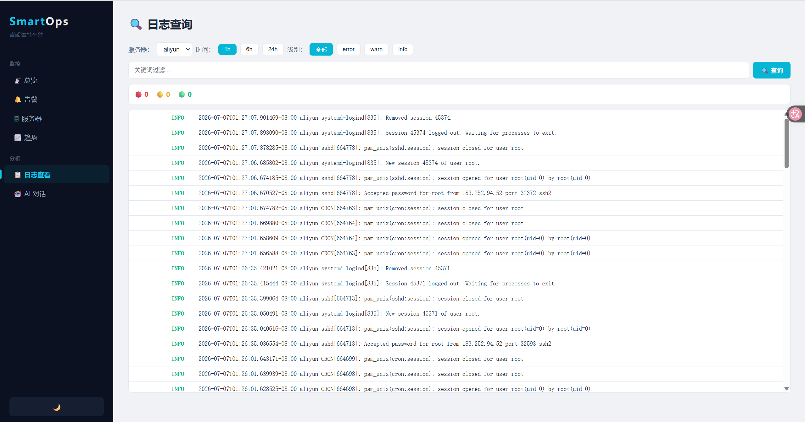
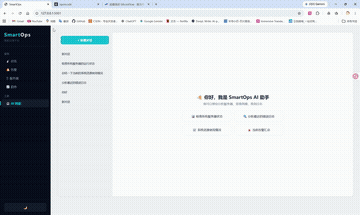

# SmartOps — 智能运维平台

> LangGraph 多 Agent 故障分析 · RAG 混合搜索 · 服务器监控告警 · AI 对话

[]()
[]()
[]()

---

## 🖥 页面展示

<table>
  <tr>
    <td align="center"><br><strong>📡 总览</strong> — 服务器状态卡片</td>
    <td align="center"><br><strong>🖥 服务器</strong> — 表格管理</td>
  </tr>
  <tr>
    <td align="center"><br><strong>🔔 告警</strong> — 告警列表与状态流转</td>
    <td align="center"><br><strong>📈 趋势</strong> — Chart.js 图表</td>
  </tr>
  <tr>
    <td align="center"><br><strong>📋 日志</strong> — Loki 日志检索</td>
    <td align="center"><br><strong>🤖 AI 对话</strong> — 多轮会话 + RCA 报告</td>
  </tr>
</table>


---

## ✨ 核心能力

### 🧠 LangGraph 多 Agent 协作

**Supervisor 循环路由** + **3 个独立 ReAct Agent**，自然语言驱动的端到端故障排查：

| Agent | 工具 | 数据源 |
|-------|------|--------|
| **Log Worker** | `query_logs` / `analyze_errors` / `count_by_level` | Grafana Loki |
| **Infra Worker** | `query_metric` / `range_query` / `check_alerts` | Prometheus |
| **Knowledge Worker** | `search_knowledge_base` | ChromaDB + BM25 |

用户提问 → Supervisor 决策路由 → Worker Agent 自主分析 → Supervisor 汇总 → Markdown RCA 报告（根因分析 + 修复建议 + 预防措施）

### 🔍 混合搜索 RAG

BM25 + Dense Embedding **双路召回** → Cross-Encoder **重排序** → 类别多样性过滤

- **Qwen3-Embedding-8B** 语义向量 + **BM25Okapi** + jieba 精确关键词匹配
- **Qwen3-Reranker-8B** 交叉编码器逐对打分，Top-5 命中率提升 ~25%
- 800+ 篇运维文档（Linux/K8s/Docker/网络/监控），**faithfulness 82%**

### 📊 全链路评估

| 指标 | Hybrid | Vector-only | 提升 |
|------|--------|-------------|------|
| Recall@5 | **92.0%** | 68.0% | +24% |
| Precision@5 | **85.3%** | 62.7% | +22.6% |
| MRR | **90.0%** | 70.0% | +20% |
| Faithfulness | **0.78** | 0.70 | +0.08 |

50 条黄金测试集（4 大类）、JSON 分层缓存、Ragas 自动评分

### 🖥 服务器监控

- **60s 心跳检测**（Paramiko SSH）+ 离线告警自动生成/恢复
- **Prometheus** + node_exporter 采集指标，**Loki** + promtail 采集日志
- 告警状态流转：`open → acknowledged → resolved`

### 💬 多轮会话

对话历史存 PostgreSQL，Agent 自动加载上下文实现连续多轮运维对话。

---

## 🏗 系统架构

```
用户 → Flask API → LangGraph Supervisor (DeepSeek)
                    ├→ Log Worker → Loki (云服务器)
                    ├→ Infra Worker → Prometheus (云服务器)
                    ├→ Knowledge Worker → ChromaDB + BM25
                    └→ 对话记忆 → PostgreSQL
```

## 🗄 数据模型

```
Server — Metric — Alert — Log — Probe
Conversation — Message
```

## 🛠 技术栈

| 层 | 技术 |
|---|---|
| 后端 | Python, Flask |
| AI | LangGraph, LangChain ReAct Agent, DeepSeek (OpenCode) |
| 检索 | ChromaDB, Qwen3-Embedding, BM25, Qwen3-Reranker |
| 评估 | Ragas (Faithfulness) |
| 存储 | PostgreSQL (SQLAlchemy), Fernet 加密 |
| 监控 | Prometheus + node_exporter, Grafana Loki + promtail |
| 前端 | Vue 3 + Pinia + Vue Router + Chart.js |
| 容器 | Docker Compose |

---

## 🚀 快速开始

```bash
pip install -r requirements.txt
# 配置 .env：DATABASE_URL / API Keys / ENCRYPTION_KEY
docker compose up -d                    # 启动 Loki + Prometheus
python kb/init_knowledge_base.py       # 初始化知识库
python api.py                          # 启动服务 → http://localhost:5001
```

## 📁 项目结构

```
SmartOps/
├── api.py                   # Flask 主入口（15+ REST API）
├── llm/                     # AI 核心
│   ├── agent.py             # chat() 入口 → 转发 Supervisor
│   ├── supervisor.py        # LangGraph StateGraph 循环路由
│   ├── workers.py           # 3 个 ReAct Agent
│   ├── tools.py             # Agent 级工具函数
│   ├── rag.py               # ChromaDB 封装
│   ├── retriever.py         # BM25 + 向量 + RRF + 重排序
│   └── mcp/                 # Loki & Prometheus MCP 封装
├── kb/                      # 知识库导入 + 评估管线
├── collector/               # SSH 心跳采集 + 云服务器同步
├── store/                   # SQLAlchemy 模型 + 加密
├── frontend/                # Vue 3 源码（7 页面）
├── tests/                   # 8 个测试文件
└── docker-compose.yml       # Loki + Prometheus
```

## 🎯 路线图

- [x] 多 Agent 协作（Supervisor + 3 ReAct Worker）
- [x] RAG 混合搜索 + 评估体系
- [x] Loki 日志 + Prometheus 指标集成
- [x] 告警引擎 + 多轮会话
- [x] 密码安全存储（Fernet）
- [ ] 多模态知识注入
- [ ] 运维日报 Agent
- [ ] 自动故障修复 Agent
